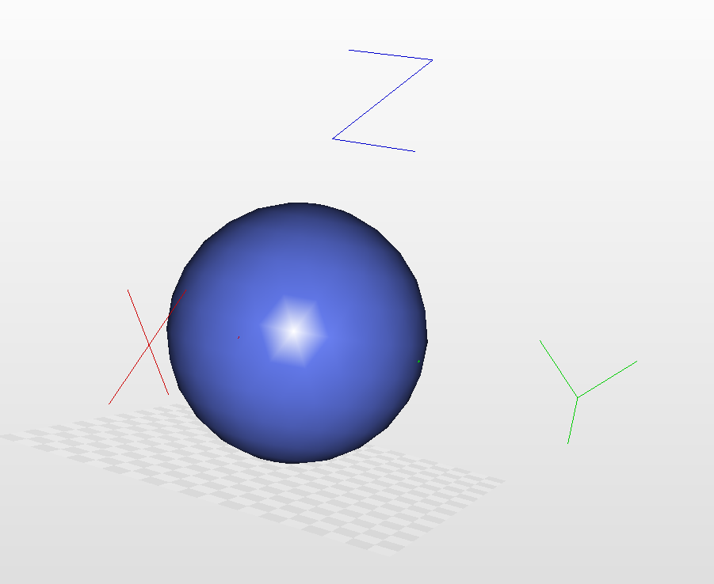
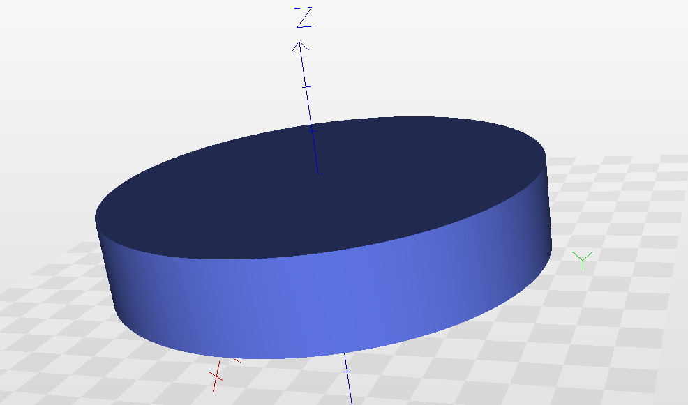
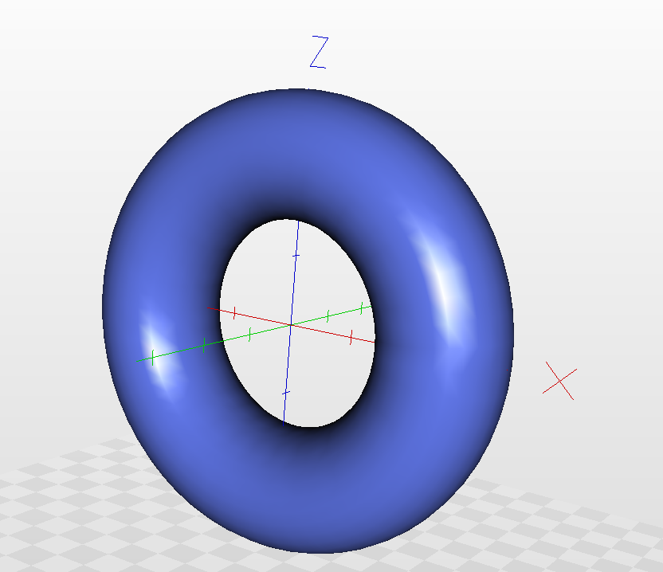
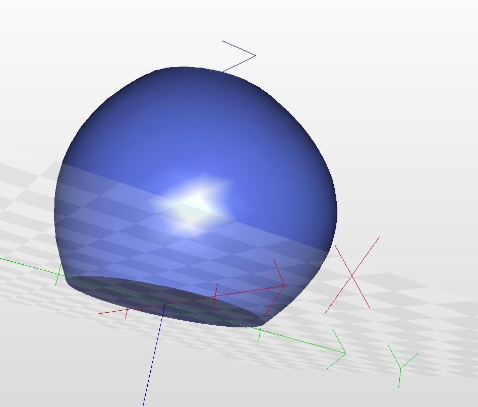

# Description of the Monty's CAD Language

## 3D primitives

### Cube

```python
cube(size, center = False)
```

Where:
+ `size` is the list `[lenght, wide, height]`. If `size` is simply a number (`n`) then it is `[n, n, n]`.
+ `center` can be `True` or `False`. If it is `True` it's centered at the origin, if it's `False` it rests at the first octant touching the origin.

#### EXAMPLES

__First octant cube__

```python
cube(20)
```


__Centered cube__

```python
cube(20, center = True)
```


__Cube with sides of diferent lenght__

```python
cube([65, 30, 10])
```


### Sphere

Creates a sphere centered at the origin.

```python
sphere(r, d = None)
```

Where:
+ `r` is the radius.
+ `d` is the diameter.

#### EXAMPLES

Both code lines generate the same result.

```python
sphere(6)
```
```python
sphere(d = 12)
```



### Cylinder

```python
cylinder(r, h, d = None, center = False)
```

Creates a cilinder of radius `r` (or alternitively of diameter `d`) and height `h`.
It's center can be placed at the origin by seting `center` with `True`. It's base
is always placed at the XY at the center.

### EXAMPLES

Both lines of code generate the same geoemetry.

```python
cylinder(r = 23, h = 12)
```
```python
cylinder(d = 46, h = 12)
```


In order to center the cylinder we have to set `center = True`.

```python
cylinder(r = 23, h = 12, center = True)
```

### Cone

```python
cone(h, r1, r2 = 0, center = False)
```

Creates a cone of height `h`, radius `r1` that can be centered with `center = True`.
An optional radius `r2` can be given in order to make a cone with a cut at the top.

#### EXAMPLES

```python
cone(h = 30, r1 = 25)
```


```python
cone(h = 30, r1 = 25, r2 = 18)
```


<br/><br/>

## Boolean operations

### Union

```python
union(obj1, obj2)
```

Returns a new object that is the union the objects `obj1` and `obj2`.
The `+` operator can be used as well.

```python
obj1 + obj2
```

#### EXAMPLES

```python
cube([5, 5, 1]) + cone(h = 2, r1 = 5, r2 = 4)
```


### Intersection

```python
intersection(ob1, ob2)
```

Returns a new object out of the intersection of the objects `obj1` and `obj2`. The `*` operator can be used as well.

```python
obj1 * obj2
```

#### EXAMPLES

```python
cube(20) * sphere(20)
```


### Differenece

```python
difference(obj1, obj2)
```

Returns a new object out of the difference of the objects `obj1` and `obj2`. The `-` operator can be used as well.

```python
obj1 - obj2
```

#### EXAMPLES

```python
cube(30, center = True) - sphere(d = 34)
```


<br/><br/>

## Rotation and translation

In order to perform rotation and translation operations in 3d objects closures are used.
In python they are aplied by simply following the syntax `operation(arguments) (object)`.

### Translation

```python
translate(vector) (obj)
```

Where:
+ `vector` is the incremental displacement of the object.
+ `obj` is the object in which is aplied the translalation.

#### EXAMPLES

```python
translate([0, 0, 10]) (cylinder(4, 3))
```


### Rotation

```python
rotate(axis, angle, axis_pos = [0, 0, 0]) (obj)
```

Where:
+ `axis` is the axis to perform the rotation. It can be of the form `[x, y, z]` or you can simply use for the X, Y and Z axis `"X"`, `"Y"` and `"Z"` respectively.
+ `angle` describes in degrees the angle rotation around that axis.
+ `axis_pos` describes the position of the rottion axis, by default it is placed on the origin.
+ `obj` is the object in which is aplied the rotation.

#### EXAMPLES

__Rotation around the origin I__

```python
rotation(axis = "Z", angle = 60) (cube(3))
```


__Rotation around the origin II__

```python
A = translate([10, 0, 0]) (cube(4))
rotation(axis = "Z", angle = 60) (A)
```


__Rotation around an arbitrary point__

```python
A = translate([10, 0, 0]) (cube(4))
rotation(axis = "Z", angle = 60, axis_pos = [10, 0, 0]) (A)
```


<br/><br/>

## 2D primitives

Two dimensional geometry is created in the XY plane. It can be rotated and translated in the same way as 3D objects.

### Circle

```python
circle(r, d = None)
```

Creates a circle of radius `r` or of diameter `d`. It's centered at the origin.

#### EXAMPLES

Both lines of code generate the same result.

```python
circle(5)
```
```python
circle(d = 10)
```


### Line

```python
line(start_point, end_point)
```

`start_point` is the starting point and `end_point` is the ending point. A point is of the form: `[x, y]`.

#### EXAMPLES

```python
line([0, 0], [2, 1])
```

### Polyline

```python
polyline(points, closed = True)
```

Creates multiple lines that are conecting the points that are in `points`. If the start and end points are the same,
then `closed` can be used.

#### EXAMPLES

__Open__

```python
polyline([[0, 0], [3, 1], [5, 9]], closed = False)
```


__Closed__

```python
polyline([[0, 0], [3, 1], [5, 9]])
```


### Spline

```python
spline(points, closed = True, rounded = False)
```

Creates a spline that follow the points `points`. If the start and end points are the same,
then `closed` can be used. If it is `closed` and it is a round figure without vertices, then
`rounded` has to be set equal to `True`.

#### EXAMPLES

__Open__

```python
spline([[0, 0], [3, 1], [5, 9]], closed = False)
```


__Closed and not rounded (figure with a vertix)__

```python
spline([[0, 0], [3, 1], [5, 9]], closed = True)
```


__Closed and rounded__

```python
spline([[0, 0], [3, 1], [5, 9]], closed = True, rounded = True)
```


<br/><br/>

## Creating 3D objects out of 2D objects

### Extrusion

```python
extrude(h) (obj)
```

Creates a extrusion of height `h` from the figure `obj`.

#### EXAMPLES

```python
extrude(h = 20) (circle(r = 50))
```



### Revolve

```python
revolve(axis, angle = 360) (obj)
```

Creates a revolution of the figure `obj` around an axis `axis` the angle `angle`. `angle` has to be
specified in degrees, by default it is `360` degrees. If the revolutions are around the X, Y and Z
axis, in `axis` can be simply written `"X"`, `"Y"` and `"Z"`.

#### EXAMPLES

```python
A = translate([24, 0, 0]) (circle(9))
revolve("Y") (A)
```



### Loft

```python
loft(sections)
```

Creates an object out of the loft ot the list `sections`.

#### EXAMPLES

```python
A = circle(9)
B = translate([0, 1, 10]) (circle(13))
C = translate([0, 0, 20]) (circle(7))
S = [A, B, C]

loft(S)
```



### Sweep

```python
sweep(sketch, path)
```

Creates a new solid out of the sweep of `sketch` around the path `path`.

#### EXAMPLES

```python
A = rotate("Y", angle = 90) (circle(10))
path = spline(points = [[0, 0], [30, 50], [40, 59]], closed = False)

sweep(A, path)
```


<br/><br/>

## Export the geometry

```python
export(frmt = "stl", name = "X", dir = "cwd") (obj)
```

Exports the 3D or 2D geometry of an object. The available file formats depends
on the Monty's CAD Builder.

Where:
+ `frmt` is the format (`"step"`, `"iges"`, `"stl"`, etc).
+ `name` is the name of the file.
+ `dir` is the directory to export the file. By default it is the current working directory. Folders must be seperated with `/` (for example, `dir = c/Users/User/Documents`).
+ `obj`  is the object to export.
