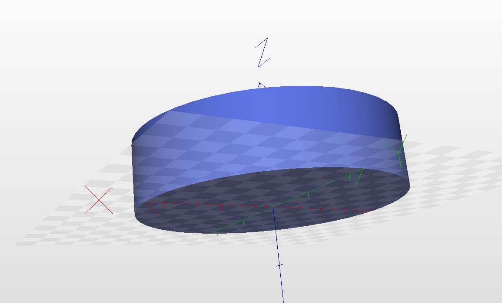
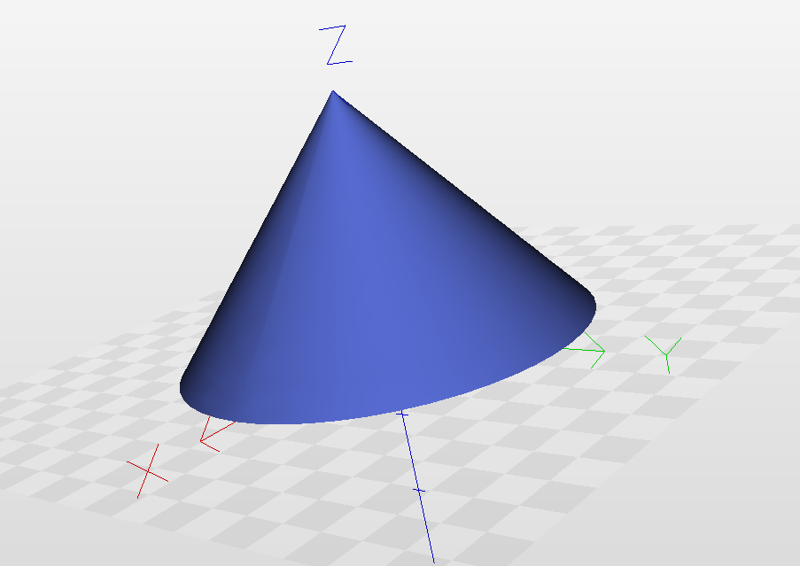
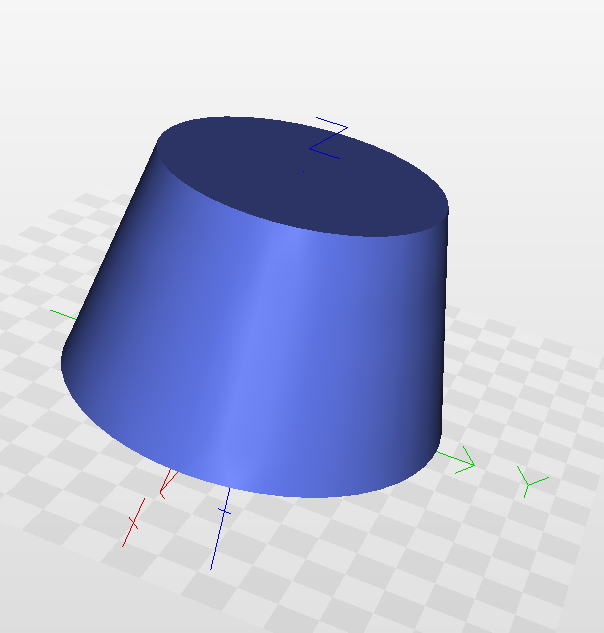

# Description of the Monty's CAD Language

  
## 3 dimensional primitives

### Cube

```python
cube(size, center = False)
```

Where:
+ `size` is the list `[lenght, wide, height]`. If `size` is simply a number (`n`) then it is `[n, n, n]`.
+ `center` can be `True` or `False`. If it is `True` it's centered at the origin, if it's `False` it rests at the first octant touching the origin.

#### Examples

__First octant cube__

```python
cube(20)
```


__Centered cube__

```python
cube(20, center = True)
```


__Cube with sides of diferent lenght__

```python
cube([65, 30, 10])
```


### Sphere

Creates a sphere centered at the origin.

```python
sphere(r, d = None)
```

Where:
+ `r` is the radius.
+ `d` is the diameter.

#### Examples

Both code lines generate the same result.

```python
sphere(6)
```
```python
sphere(d = 12)
```


### Cylinder

```python
cylinder(r, h, d = None, center = False)
```

Creates a cilinder of radius `r` (or alternitively of diameter `d`) and height `h`.
It's center can be placed at the origin by seting `center` with `True`. It's base
is always placed at the XY origin.

### Examples

Both lines of code generate the same geoemetry.

```python
cylinder(r = 23, h = 12)
```
```python
cylinder(d = 46, h = 12)
```



In order to center the cylinder we have to set `center = True`.

```python
cylinder(r = 23, h = 12, center = True)
```

### Cone

```python
cone(h, r1, r2 = 0, center = False)
```

Creates a cone of height `h`, radius `r1` that can be centered with `center = True`.
An optional radius `r2` can be given in order to make a cone with a cut at the top.

#### Examples

```python
cone(h = 30, r1 = 25)
```



```python
cone(h = 30, r1 = 25, r2 = 18)
```



## Rotation and translation

In order to perform rotation and translation operations in 3d objects closures are used.
In python are aplied by simply following the syntax `operation(argument) (tridimensional_object)`.

### Rotation

```python
rotate(axis, angle, axis_pos = [0, 0, 0])
```

Where:
+ `axis` is the axis to perform the rotation. It can be of the form `[x, y, z]` or you can simply use for the X, Y and Z axis `"X"`, `"Y"` and `"Z"` respectively.
+ `angle` describes in degrees the angle rotation around that axis.
+ `axis_pos` describes the position of the rottion axis, by default it is placed on the origin.

#### Examples

__Rotation around the origin I__

```python
rotation(axis = "Z", angle = 60) (cube(3))
```


__Rotation around the origin II__

```python
A = translate([10, 0, 0]) (cube(3))
rotation(axis = "Z", angle = 60) (A)
```


__Rotation around an arbitrary point__

```python
A = translate([10, 0, 0]) (cube(3))
rotation(axis = "Z", angle = 60, axis_pos = [10, 0, 0]) (A)
```


